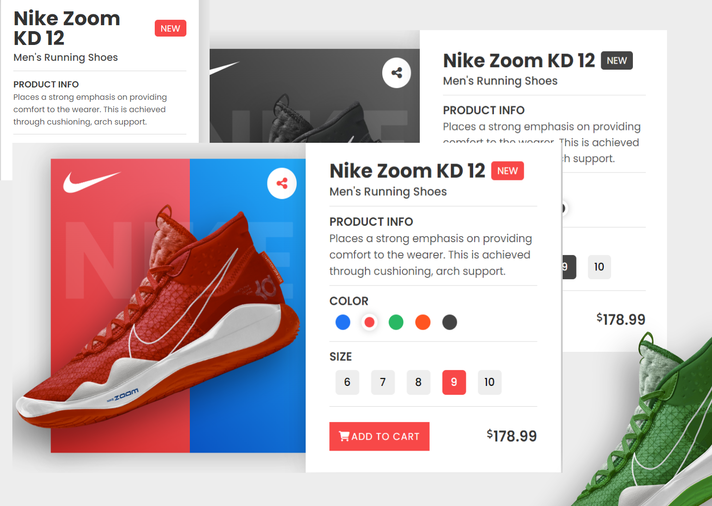

# Nike Shoes Product Page

Welcome to the Nike Shoes Product Page repository! This project showcases a modern, interactive product page for Nike shoes, allowing users to switch between multiple color themes and select their preferred shoe size. The page is built using HTML, CSS, and JavaScript to deliver a seamless user experience.

## Preview



## Features

- **Multiple Color Themes**: Users can switch between various color themes to see how the Nike shoes look in different styles.

- **Size Selection**: The product page includes a size section that allows users to choose their preferred shoe size.

- **Responsive Design**: The UI is designed to work flawlessly on both desktop and mobile devices.

- **Modern User Interface**: The design is sleek and modern, providing an engaging shopping experience.

## How to Use

1. Clone the repository to your local machine.

   ```
   git clone https://github.com/Devsethi3/Nike-Shoes-Product-Page.git
   ```

2. Open the `index.html` file in your web browser to view the Nike Shoes Product Page.

3. Explore different color themes and select your preferred shoe size.

4. Customize and extend the project to fit your specific needs.

## Contributions

Contributions are welcome! If you'd like to enhance this project or fix any issues, please follow these steps:

1. Fork the repository.

2. Create a new branch for your feature or fix:

   ```
   git checkout -b feature-name
   ```

3. Make your changes and commit them:

   ```
   git commit -m 'Add feature or fix'
   ```

4. Push to your fork:

   ```
   git push origin feature-name
   ```

5. Create a pull request on the main repository's `main` branch.

Feel free to reach out if you have any questions or feedback! We hope you find this project useful and enjoy using it for your cafe website.
